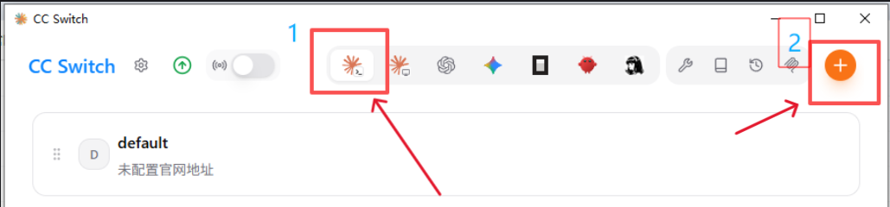
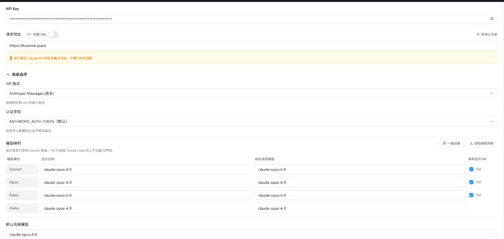
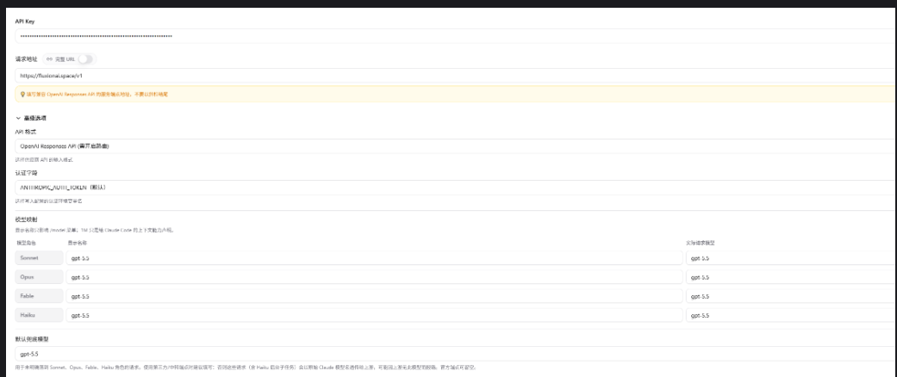
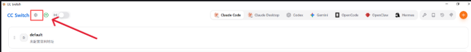
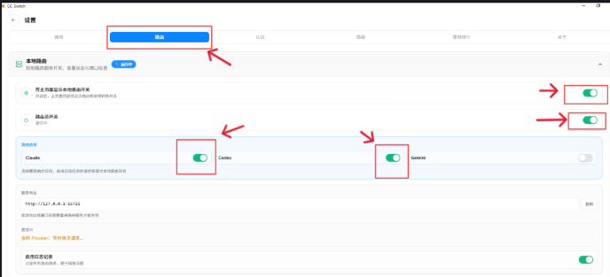
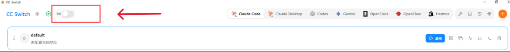
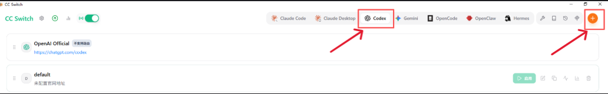
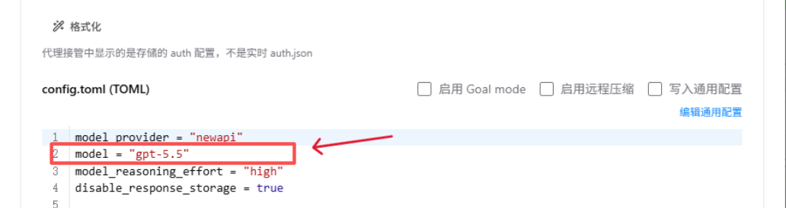

# 新手引导

欢迎使用 Fluxion AI！本页面将帮助你快速上手，了解如何充值、创建 API Key、配置客户端，以及解决常见问题。

> **📌 重要提示**：本页仅提供基础的新手引导，详细说明请查看 [帮助中心](https://docs.fluxionai.space/user-guide/help-center)。

---

## 目录

- [一、快速上手](#quick-start)
  - [第一步：充值余额 / 订阅套餐](#recharge-subscribe)
  - [第二步：创建 API Key](#create-api-key)
  - [第三步：客户端中使用](#client-config)
    - [3.1 客户端选择](#client-config)
    - [3.2 基础参数说明](#client-config)
    - [3.3 CC-Switch 的配置方法](#cc-switch-config)
    - [3.4 xAI / Grok 接口使用](#xai-config)
- [二、常见问题](#faq)
  - [2.1 CCS 使用中出现 502 Bad Gateway](#faq-502)
  - [2.2 CCS 使用中出现 model_not_found 错误](#faq-model-not-found)
- [三、获取帮助](#support)

---

## 一、快速上手 {#quick-start}

### 第一步：充值余额 / 订阅套餐 {#recharge-subscribe}

Fluxion AI 提供两种使用方式：**按量付费（余额）** 和 **订阅套餐**。

#### 按量付费（余额）

- **适用场景**：使用量较小且不固定，按实际消耗付费
- **充值方式**：充值/订阅 页面 → 选择充值金额 → 完成支付后即时到账（右上角余额）
- **费用计算**：根据实际 API 调用消耗扣除余额

#### 订阅套餐

- **适用场景**：长期固定的 Token 使用，购买套餐享受额度与分组倍率的双重折扣
- **订阅方式**：充值/订阅 页面 → 切换至订阅页面 → 选择适合的套餐 → 完成支付后套餐即时生效（可在"我的订阅"页面查看）
- **套餐特点**：套餐内额度独立计算，不与余额混用
- **套餐限制**：套餐购买以该套餐周期（日/周/月）的总额度为准，更短周期的限额仅作为阶段性号池保护的目的做出的限制存在

> **⚠️ 重要提示**
>
> 1. **余额和套餐是两种独立的消费方式**，需要创建对应类型的 API Key 才能使用（详见下文）
> 2. **优先选择站内充值**（手续费更低），其次选择 [卡网购买兑换码](https://pay.ldxp.cn/shop/Z7IB8KMQ) 进行站内兑换
> 3. **站内支付需要在 PC 浏览器中使用**，移动端网页无法正确跳转

---

#### 💰 消费价格说明

**1. 额度定价**

- 本站余额充值比例为 **1:1**，即 1 元人民币 = 1 美元站内额度
- GPT 类套餐的折扣比例约为 **8折起**，Claude 类套餐的额度比例为 **7.5折** 起

**2. 消费定价**

- 本站所有模型的基础计价与官方 API 价格同步一致，作为扣费基准价格（1 倍率）
- 实际消费根据不同分组的倍率进行实际扣费计算
  - **示例**：用户选择 0.05 倍率分组，消费的 token 基准价格是 2 美元，则账户实际扣费为 `2 × 0.05 = 0.1 美元 = 0.1 人民币`

**3. 套餐与余额的差异**

- 订阅套餐的整体消费价格远低于余额结算，但受阶段性使用限额的限制
- 用户可以通过加油卡购买的方式解除短期限额，当前订阅存在有效的加油卡时，优先扣费加油卡
- 订阅套餐的消费倍率普遍优于余额结算

---

### 第二步：创建 API Key {#create-api-key}

API Key 是你访问 Fluxion AI 服务的凭证。**根据你的付费方式，需要创建对应类型的 API Key**。

API Key 绑定不同的分组，可以使用该分组提供的模型，不同分组支持的模型/模型来源不同，定价也不同。

#### 🔑 API Key 类型说明

Fluxion AI 的 API Key 分为两种类型，**通过名称区分**：

| API Key 类型 | 名称标识 | 消费方式 | 适用场景 |
| --- | --- | --- | --- |
| **余额型 API Key** | 名称中带有 **"余额"** 二字 | 从账户余额中扣费 | 按量付费用户 |
| **套餐型 API Key** | 名称中带有 **"订阅"** 二字 | 从订阅套餐额度中扣费 | 订阅套餐用户 |

#### 📝 创建步骤

1. 登录后进入 **"API 密钥"** 页面
2. 点击 **"创建密钥"** 按钮
3. 填写 API Key 名称（自定义，方便识别用途）
4. 点击 **"创建"**，复制生成的 API Key
5. 可以创建多个 API Key，分别用于不同项目或客户端、不同的模型

---

### 第三步：客户端中使用 {#client-config}

创建 API Key 后，你需要在客户端（如 Claude Code、Codex、CC-Switch 等）中填写连接参数。

### 3.1 AI客户端选择

AI的使用通常情况下包括两种方法：网页端对话、Agent客户端（包含管理多个Agent的orchestra客户端），网页端通常只有对话和联网搜索功能，无法使用skill/MCP/工具调用等能力。 Agent客户端能够覆盖更多的使用场景，推荐所有刚入门的同学直接学习使用Agent客户端。

通常情况下，Agent客户端包含两种类型：

1. CLI：例如claude code cli，只包含最核心的功能，无美观的UI界面，直接在命令行环境中使用，也可以通过UI插件的形式在其他编程IDE中使用（VSCODE、Pycharm等），不合适小白直接使用，在此不做赘述（会使用的人也不需要教程）
2. Desktop：通常是官方或第三方提供的桌面版应用客户端，集成了CLI的功能及其他能力，推荐入门的新手使用，常见的包括Claude Code、Codex、Cherry Studio等，使用GPT的同学直接使用Codex、使用Claude模型的同学直接使用Claude Code 不太建议在Claude Code中使用GPT模型，因为Anthropic在Claude Code中对非claude系列的模型增加了额外的限制

客户端下载：

- Claude Code：[https://claude.ai/login](https://claude.ai/login)
- Codex：[https://openai.com/zh-Hans-CN/codex/](https://openai.com/zh-Hans-CN/codex/)

根据使用场景的客户端推荐：

1. 编程：Claude Code / Codex均可，追求性能则是Claude Code + Claude模型，追踪性价比就是Codex + GPT
2. 日常文档处理/文案写作：Codex + GPT
3. 行业研究/深度分析：Claude Code + Claude

> **说明** 以上推荐是基于模型的特征和能力的个人建议，具体请根据个人偏好、使用习惯等进行选择 Claude模型：深度思考和推理能力最强，更擅长拆解/分析/解决复杂任务，性格更冷静、直戳要害，追求的是最好的解决方案 GPT模型：深度思考和推理能力仅次于Claude，更具备共情能力，追求的是完成度和全面性

在安装好客户端后，再通过下述流程完成本站接口替换官方接口的设置，这样就可以使用本站提供的模型API了。 新人使用建议直接使用cc-switch的方案完成 上游官方-> 中转站 -> CCS -> 客户端 的配置

---

#### 3.2 基础参数说明

不同分组的 API Key 对应不同的请求基础参数。在配置客户端时，需要填写以下信息：

| 参数名称 | 说明 | 示例 |
| --- | --- | --- |
| **API Key** | 你创建的 API Key | `sk-xxxxxxxxxxxxxxxx` |
| **Base URL** | API 请求地址（根据分组不同而不同） | `https://fluxionai.space` |
| **Model** | 可用的模型列表（根据分组不同而不同） | `gpt-5.5`, `claude-opus-4-8` 等，具体模型名称可至"模型广场"页面查看 |

**如何查看你的分组参数**

1. 登录 Fluxion AI 后台，进入 **"API 密钥"** 页面
2. 找到你创建的 API Key：
   - 🟡 **黄色** = Anthropic 接口格式
   - 🟢 **绿色** = OpenAI 接口格式
   - 🔵 **蓝色** = Gemini 接口格式
3. 在客户端配置时，填写对应分组的 Base URL 和 API Key

**不同分组的 Base URL**

| 分组类型 | Base URL | 完整请求 URL |
| --- | --- | --- |
| **Anthropic 分组** | `https://fluxionai.space` | `https://fluxionai.space/v1/messages` |
| **OpenAI 分组** | `https://fluxionai.space/v1` | `https://fluxionai.space/v1/responses` (Codex 接口) `https://fluxionai.space/v1/chat/completions` (OpenAI 兼容接口) |

> **💡 提示**：完整 URL 仅用于客户端不补全 URL 的情况。

---

### 3.3 CC-Switch 的配置方法 {#cc-switch-config}

CC-Switch 是一个适用于多个 Agent 客户端（Claude Code / Codex / Hermes / OpenCode / OpenClaw 等）的中转工具，用于在多个 API 提供商之间切换。

**下载 CC-Switch**：请参考 [CC-Switch 官方文档](https://github.com/farion1231/cc-switch)。

---

#### 3.3.1 Claude Code CLI / Claude Code Desktop 配置

**① 添加自定义 Provider**

**② 填写自定义配置**

Anthropic 分组填写方法（按下图填写对应的配置）：

OpenAI 分组填写方法（按下图填写对应的配置）：

> **⚠️ 注意**：OpenAI 分组需要开启本地路由。建议打开完整 URL 并开启本地路由（更稳定），如果打开完整 URL 需要按 [3.1](#client-config) 中的完整地址填写请求地址。

本地路由开启后可随时在主页关闭：

**③ 保存配置并点击该配置的"使用"按钮**

---

#### 3.3.2 Codex 配置

**① 添加自定义 Provider**

**② 填写自定义配置**

OpenAI 分组填写方法（按下图填写对应的配置）：

> **⚠️ 注意**
>
> - 如果需要在 Codex 中使用 Anthropic 分组的 API Key，请求地址需要填写：`https://fluxionai.space/vip/v1`
> - 如果需要配置多个模型，可以在模型映射中进行设置

### 3.4 xAI / Grok 接口使用 {#xai-config}

Grok（xAI）使用 OpenAI 兼容接口，参数与 OpenAI 分组相同：

- **Base URL**：`https://fluxionai.space/v1`
- **接口路径**：`/v1/chat/completions`
- **Model**：填写 Grok 模型（如 `grok-4.5`），具体可至“模型广场”页面查看

图像模型（如 `grok-imagine`）请改用 `/v1/images/generations` 接口。

---

## 二、常见问题 {#faq}

### 2.1 CCS 使用中出现 502 Bad Gateway {#faq-502}

**常见原因**

1. CCS 与客户端之间的网关建立出现 Bug
2. 主站服务停机（请关注 QQ 群内通知）
3. 当前 session 超过上下文限制

**解决方案**

1. 关闭再打开本地路由开关
2. 重启当前客户端
3. 新建一个 session

---

### 2.2 CCS 使用中出现 model_not_found 错误 {#faq-model-not-found}

**可能原因**

1. 模型名称填写错误
2. API Key 绑定的分组不支持该模型
3. CCS 自身的 Bug

**解决方法**

1. **检查模型名称是否正确**：可以在站内"模型广场"中获取具体的名称
2. **确认你的分组支持该模型**：本站同一类分组可访问的模型完全一致，只需确认分组是否正确（例如：不要在 OpenAI 分组请求 Claude 系列模型）
3. 关闭再打开本地路由开关
4. 重启当前客户端
5. 新建一个 session

---

## 三、获取帮助 {#support}

如果你在使用过程中遇到其他问题，可以：

- 查看 [帮助中心](https://docs.fluxionai.space/user-guide/help-center) 获取更详细的功能说明
- 加入用户交流 QQ 群 **1076140277** 获取社区帮助

感谢使用 Fluxion AI！
